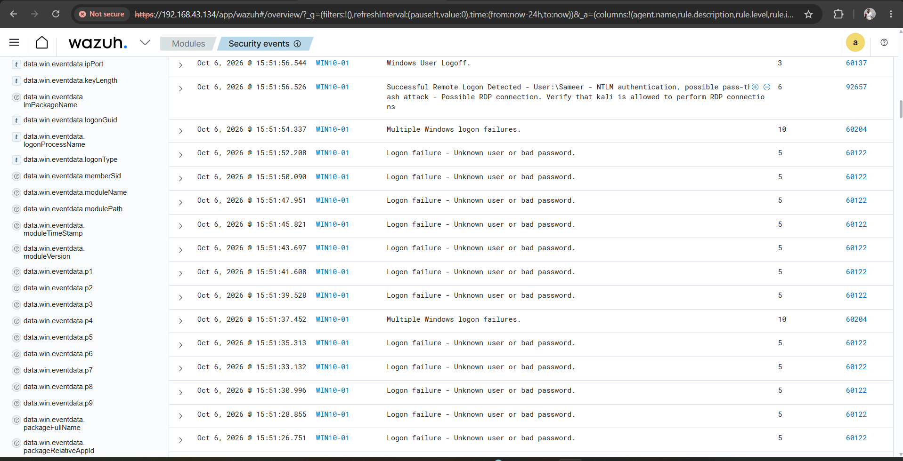

### Pass-the-Hash Detection

Wazuh detected a successful remote RDP logon using NTLM authentication on the Windows endpoint **WIN10-01**. The activity was flagged as potential Pass-the-Hash behavior.

- **Detection Platform:** Wazuh
- **Target System:** WIN10-01
- **User:** Sameer
- **Protocol:** RDP
- **Authentication:** NTLM
- **Wazuh Rule ID:** 92657
- **Alert Severity:** Level 6
- **Potential Technique:** T1550.002 — Pass the Hash

**SOC Analysis:**

A successful remote logon using NTLM authentication was detected following multiple failed authentication attempts. Wazuh identified the activity as a potential Pass-the-Hash scenario.

**Result:**

Wazuh successfully identified and alerted on suspicious remote RDP authentication activity using NTLM, providing the SOC with an indicator for further investigation of potential credential-based lateral movement.