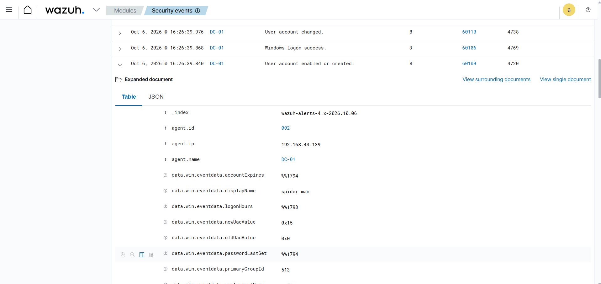

### Account Creation Detection

Wazuh detected the creation of a new Active Directory user account on the Domain Controller **DC-01**.

- **Windows Event ID:** 4720 — A user account was created
- **Wazuh Rule ID:** 60109 — User account enabled or created
- **Alert Severity:** Level 8
- **Detection Platform:** Wazuh
- **Target System:** DC-01

**SOC Analysis:**

A new user account creation event was detected on the Domain Controller. From a SOC perspective, unexpected account creation can indicate unauthorized persistence or privilege escalation, particularly when the account is created by a compromised or unauthorized administrator.

In this event, the newly created account was **"spider man"**.

**Result:**

Wazuh successfully detected the Active Directory account creation through Windows Security Event ID **4720**, providing visibility into changes to user accounts within the domain.