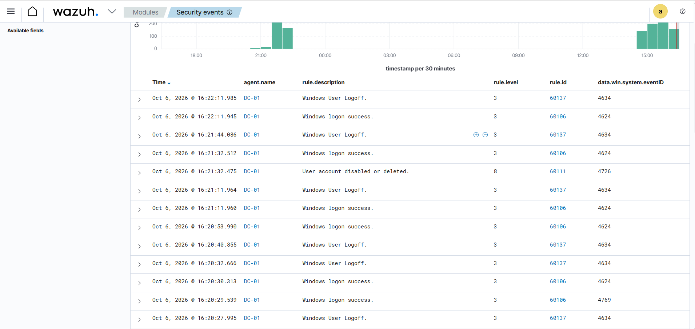

### Account Deletion Detection

Wazuh detected an Active Directory user account deletion on the Domain Controller **DC-01**.

- **Windows Event ID:** 4726 — A user account was deleted
- **Wazuh Rule ID:** 60111 — User account disabled or deleted
- **Alert Severity:** Level 8
- **Detection Platform:** Wazuh
- **Target System:** DC-01

**SOC Analysis:**

An account deletion event was detected on the Domain Controller. Account deletion can be a legitimate administrative action, but unexpected deletion of an Active Directory account may indicate malicious activity, especially when performed by an unauthorized or compromised privileged account.

**Result:**

Wazuh successfully detected the Active Directory account deletion through Windows Security Event ID **4726**, providing security monitoring and investigation visibility into changes made to user accounts.