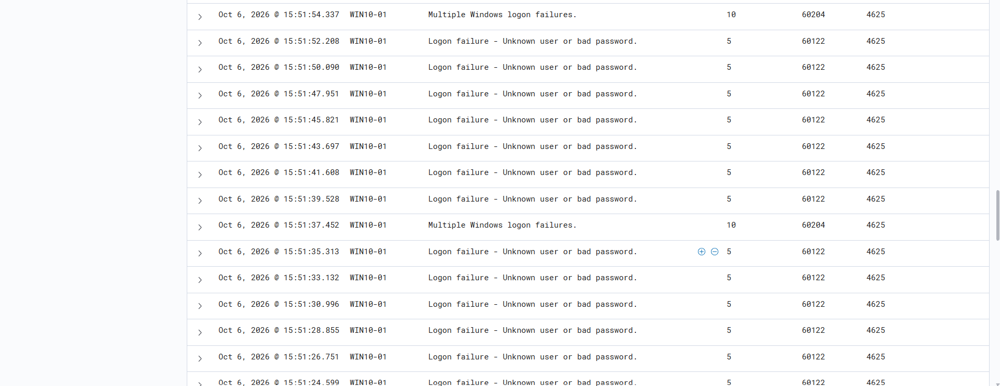

### Brute Force Detection

Wazuh detected multiple failed login attempts on the Windows endpoint **WIN10-01** within a short period, indicating potential brute-force activity.

- **Windows Event ID:** 4625 — Failed Logon
- **Wazuh Rule ID:** 60122 — Logon failure: Unknown user or bad password
- **Wazuh Rule ID:** 60204 — Multiple Windows logon failures
- **Alert Severity:** Level 10 — Multiple Logon Failures
- **MITRE ATT&CK:** T1110 — Brute Force

**SOC Analysis:**

Multiple authentication failures were observed within a short time interval. Wazuh correlated the failed login events and generated a high-severity alert, indicating potential automated password-guessing activity.

**Result:**

Wazuh successfully detected repeated authentication failures, demonstrating its capability to identify potential brute-force attacks through Windows Security Event Log monitoring.